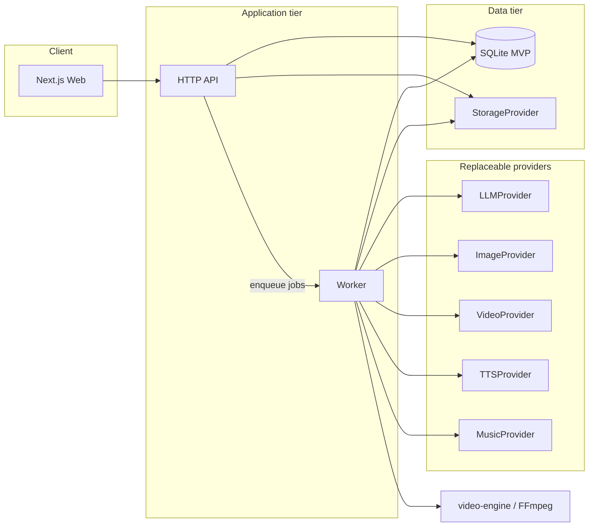

# Architecture Overview

High-level design for **AI Story Video Generator**. Detailed phase order lives in [implementation-plan.md](./implementation-plan.md).

## System context

## Layering rules

1. **Domain** (`packages/shared`): enums, types, state machines — no I/O.
2. **Repositories** (`packages/db`): persistence only; swappable SQLite → Postgres.
3. **Providers** (`packages/providers`): all AI and external generation; mock first.
4. **Video engine** (`packages/video-engine`): assembly only; no HTTP.
5. **Apps**: thin wiring — routes, DI/factories, env parsing.

## Async generation

HTTP handlers **never** block on generation. Pattern:

1. `POST /api/projects/:id/generate` creates job(s), returns `202` + job ids.
2. Worker processes steps; updates `Project.status`, `Project.progress`, per-scene asset status.
3. Client polls `GET /api/projects/:id/progress` or SSE (optional later).

## Long-form video strategy

- Target duration is user-configurable (no hard max in code).
- Scene count: `ceil(targetDurationSec / targetSceneDurationSec)` (configurable default ~8s).
- Each scene → short clip → normalize → concat → audio/subtitles → `final.mp4`.
- Single-scene regen replaces one clip then re-runs assembly only.

## Project status machine

Valid transitions enforced in domain layer (not ad-hoc strings in handlers):

`DRAFT → ANALYZING → PLANNING → GENERATING_* → ASSEMBLING → PROCESSING → COMPLETED`

Failure: any active state → `FAILED`. Cancel: queued/running jobs → `CANCELLED`.

## Mock vs real

When `MOCK_AI=true` (or all providers set to `mock`):

- Deterministic placeholders for images/video/audio.
- UI shows development/mock indicator — never masquerade as real AI output.

Real providers are selected only via environment configuration and capability checks at startup.

## Deployment

See [deployment.md](./deployment.md) for **Mode A** (single host) and **Mode B** (API/web vs GPU worker), Docker, and optional Hugging Face Space notes.

## Windows development

- PowerShell-friendly scripts in `scripts/`.
- Paths via `path.join`; FFmpeg invoked with explicit executable path when configured.
- SQLite and local storage — no Docker required for MVP.

## Extension points (not MVP)

YouTube/TikTok export, accounts, voice clone, lip sync, S3 storage — implement as new providers or app modules without changing core pipeline interfaces.
